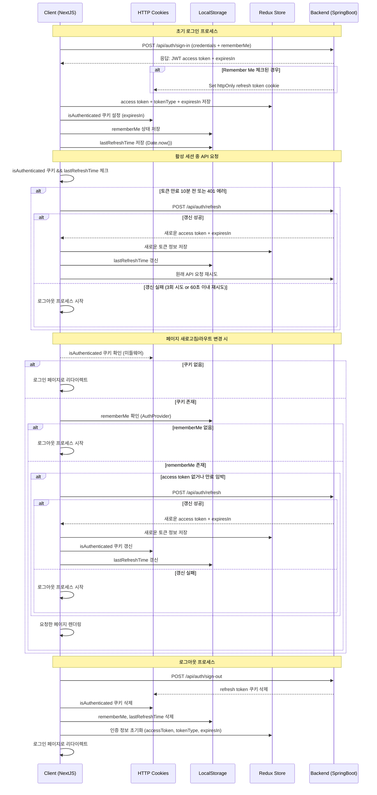

# 1 JWT 인증 시스템

## 1.1 흐름도

## 1.2 개요 설명

### 1.2.1 로그인 프로세스:

- `onSubmit` 함수: 초기 로그인 요청 처리
- `auth.slice.ts`: Redux Store에 토큰 정보 저장 (`setCredentials`)
- `auth.ts`: 인증 쿠키 관리
- `storage.ts`: localStorage 관리 (rememberMe, lastRefreshTime)

### 1.2.2 토큰 갱신 프로세스:

- `baseQueryWithRetry.ts`: 토큰 만료 감지 및 갱신 로직
- 갱신 시도 제한 (MAX_REFRESH_ATTEMPTS = 3)
- 재시도 간격 제한 (REFRESH_TOKEN_EXPIRY_BUFFER = 60초)
- Mutex를 사용한 동시 갱신 방지

### 1.2.3 페이지 로드/라우트 변경 시:

- `AuthProvider.tsx`: 인증 상태 검증 및 초기화
- Next.js 미들웨어: isAuthenticated 쿠키 확인
- rememberMe 확인 및 토큰 갱신 필요성 체크

### 1.2.4 로그아웃 프로세스:

- `handleLogout` 함수: 서버 로그아웃 요청
- 모든 인증 관련 데이터 정리:
    - 쿠키 삭제 (isAuthenticated)
    - localStorage 정리 (rememberMe, lastRefreshTime)
    - Redux store 초기화

## 1.3 전체 인증 흐름 요약:

### 1.3.1 초기 인증:

- 사용자 로그인 → JWT 토큰 발급
- 자동 로그인 설정 → refresh token 쿠키 설정
- 클라이언트 상태 저장 (Redux, localStorage, 쿠키)

### 1.3.2 세션 유지:

- API 요청마다 토큰 만료 체크
- 필요시 자동 토큰 갱신
- 갱신 실패시 로그아웃 처리

### 1.3.3 상태 검증:

- 페이지 전환마다 인증 상태 확인
- 자동 로그인 설정 확인
- 필요시 토큰 갱신 또는 로그아웃

### 1.3.4 세션 종료:

- 명시적 로그아웃 또는 갱신 실패시
- 모든 인증 데이터 삭제
- 로그인 페이지로 리다이렉션

## 1.4. 주요 파일

* [baseQuery.ts](/src/store/baseQuery.ts)
* [auth.api.ts](/src/store/auth/api.ts)
* [auth.slice.ts](/src/store/auth/slice.ts)
* [types/auth.ts](/src/types/auth.ts)
* [utils/auth.ts](/src/utils/auth.ts)
* [utils/storage.ts](/src/utils/storage.ts)
* [middleware.ts](/src/middleware.ts)
* [AuthProvider.tsx](/src/providers/auth/AuthProvider.tsx)
* [app/auth/sign-in/page.tsx](/src/app/auth/sign-in/page.tsx)
* [app/auth/sign-out/page.tsx](/src/app/auth/sign-out/page.tsx)